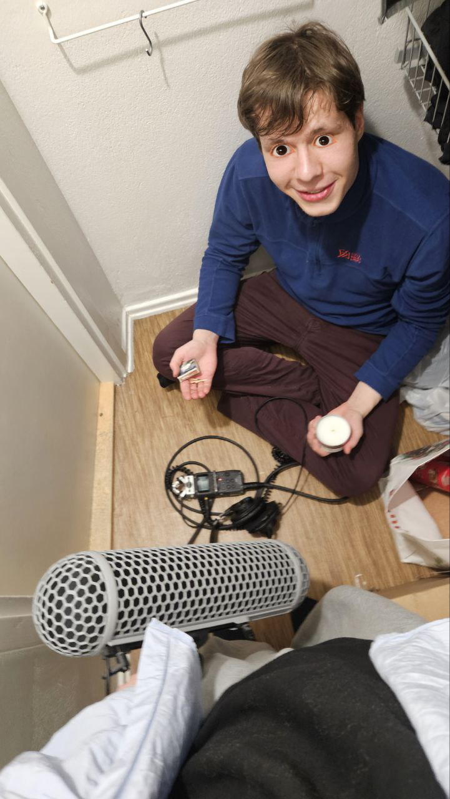

Git lfs needs to be installed (git lfs install). 

When you add or remove assets, run assetListsGenerator.js to rewrite assetLists.json.

To run tests:
npm test (for unit tests)
npx playwright test (for playwright tests)

--

Thank you for experiencing our work.

Best,
 
Antti & Heya
 

 

